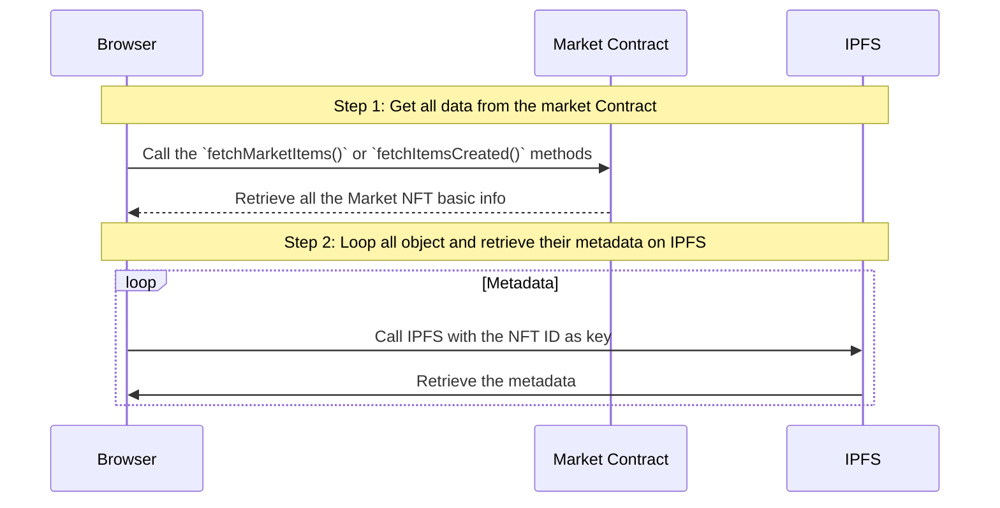
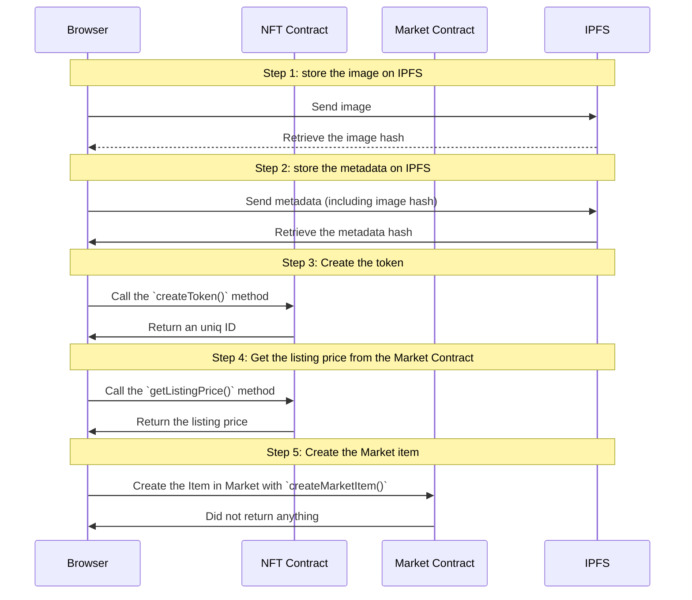
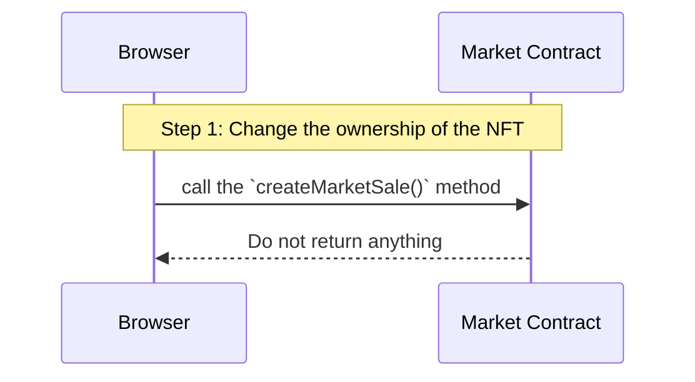
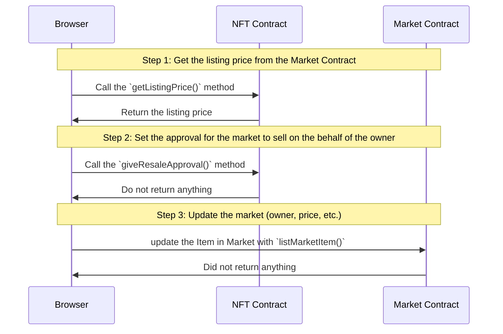

# About this project

This project is a a NFT marketplace for the blockchains Ethereum / Polygon. You can easily customize it and deploy it as a real market on your favorite blockchain !


# Technology stack

- React (Nextjs)
- Tailwind
- Solidity (0.8.11)
- ethers.js
- MetaMask
- Truffle
- Infura (IPFS)
- Ganache (only needed if you want to test locally your contract)

# Features

## Get all the listed NFT

Your browser will retrieve all the NFT through metamask, and metatada (from IPFS). This flow is used on the top page, and for th dashboard, and the "my NFT" page.



## Mint an NFT

When minting a Token (2 different contract need to be called)



## Buy an NFT

When buying an NFT from the top page (owner cannot buy their own NFT)



## Re-sell an NFT

When re-selling an NFT after purchasing it.



# Getting Started

## Smart contract (Backend)

Contracts are available under the `contracts` folder. Update the `truffle-config` file with your own blockchain networks. `Localhost` is already set (port 7545) and will work out of the box.

- Start Ganache (if localhost)
- Create a **.secret** file that contains your ganache seedphrase
- Deploy the contract :

```
npm install
truffle deploy --network development
```

- Save your 2 contracts addresses in `.env.local` :

```
NEXT_PUBLIC_MARKET_ADDRESS="0xE6Cxxxxxxxxxxxxxxxxxxxxxxxxxxxxxxxxxxx";
NEXT_PUBLIC_NFT_ADDRESS="0xE6Cxxxxxxxxxxxxxxxxxxxxxxxxxxxxxxxxxxx";
```

> You can easily retrieve your contract addresses in connecting ganache to your `truffle-config.js` file (see capture)


- Create an IPFS account on Infura and update your `.env.local` as below :

```
NEXT_PUBLIC_INFURA_IPFS_PROJECT_ID="xxxxx"
NEXT_PUBLIC_INFURA_IPFS_PROJECT_SECRET="yyyyy"
NEXT_PUBLIC_INFURA_IPFS_PRIVATE_GATEWAY="https://your-account.infura-ipfs.io/ipfs"
```

## Frontend

run the development server:

```bash
npm run dev
```

Open [http://localhost:3000](http://localhost:3000) with your browser to see the result.

# Next step

You can create PR to enhance it :

- Component refactoring (react)
- Smart contract enhancement
- etc.
